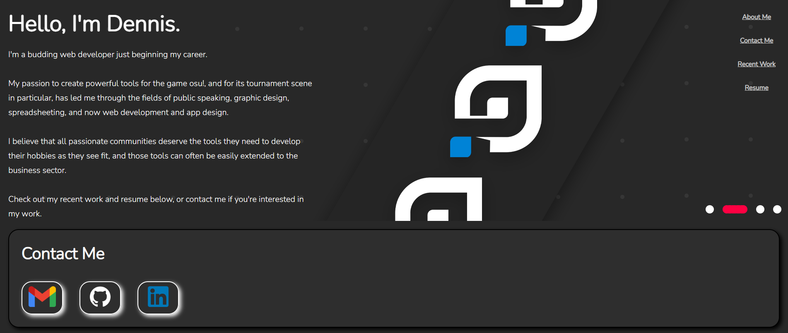
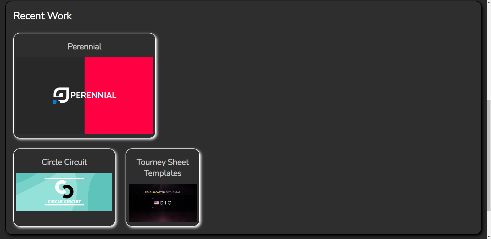
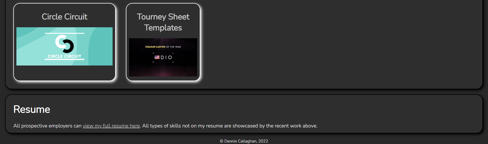

# <Portfolio>

## Description

My Portfolio is my personal webpage dedicated to showcasing my best work, specifically with web development and other technical skills.

- Before uploading this, I did not have a Portfolio site.
- Creating this was good practice for writing new CSS in particular.

## Table of Contents

- [Installation](#installation)
- [Usage](#usage)
- [Credits](#credits)
- [License](#license)

## Installation

This website is intended to be run via any web browser, but you should use Chrome or Firefox for best results. Download the whole folder from this repository, then open the index.html file in your browser. For those not wanting to host this website locally, you can use a [live deployed version here](https://drcallaghan.github.io/Portfolio/).

## Usage

After installation, usage should be the same as any other webpage, just hosted locally on your PC. See screenshots for more details about how the website should look.






## Credits

Credits to [ChillierPear](https://twitter.com/ChillierPe4r) as the creator of the images on this site. I followed guides from [W3Schools](https://www.w3schools.com/) when making this page, primarily for html and css.

## License

MIT License

```
Copyright (c) 2022 Dennis Russell Callaghan

Permission is hereby granted, free of charge, to any person obtaining a copy
of this software and associated documentation files (the "Software"), to deal
in the Software without restriction, including without limitation the rights
to use, copy, modify, merge, publish, distribute, sublicense, and/or sell
copies of the Software, and to permit persons to whom the Software is
furnished to do so, subject to the following conditions:

The above copyright notice and this permission notice shall be included in all
copies or substantial portions of the Software.

THE SOFTWARE IS PROVIDED "AS IS", WITHOUT WARRANTY OF ANY KIND, EXPRESS OR
IMPLIED, INCLUDING BUT NOT LIMITED TO THE WARRANTIES OF MERCHANTABILITY,
FITNESS FOR A PARTICULAR PURPOSE AND NONINFRINGEMENT. IN NO EVENT SHALL THE
AUTHORS OR COPYRIGHT HOLDERS BE LIABLE FOR ANY CLAIM, DAMAGES OR OTHER
LIABILITY, WHETHER IN AN ACTION OF CONTRACT, TORT OR OTHERWISE, ARISING FROM,
OUT OF OR IN CONNECTION WITH THE SOFTWARE OR THE USE OR OTHER DEALINGS IN THE
SOFTWARE.
```